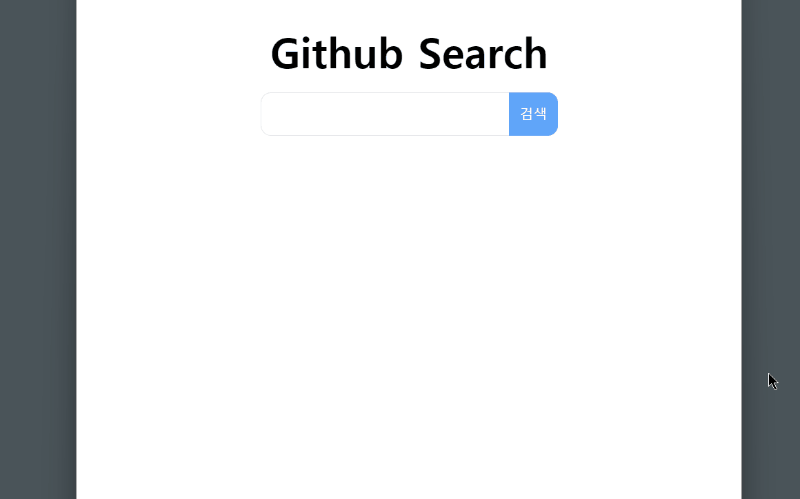
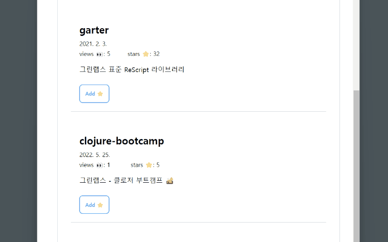

# relay-ts-app

### github repository search app

---

## Authors

- [@0teklee](https://www.github.com/0teklee)

## Demo

## Versions

- 1.0.1 Render as you fetch (main branch)
- [1.0.0 Render on fetch (renderOnFetch branch)] (https://github.com/0teklee/relay-app-ts/tree/renderOnFetch)

## Features

- 깃헙 레포지토리 검색
- 검색 결과 페이지네이션
- 레포지토리 스타 추가/삭제

## Description

Relay와 Github graphql API를 사용하여 깃헙 검색 앱을 개발했습니다. graphql, relay 사용이 처음이었기에 공식 문서와 여러 자료를 통해 학습하였고, 학습한 내용을 노트로 정리하였습니다.

### Study Node

- [GraphQL은 무엇이고 왜 사용할까?](https://teklog.site/blog/17)
- [Relay는 왜 사용할까?](https://teklog.site/blog/18)

#### work in progress

[relay-app-rescript](https://github.com/0teklee/relay-app-rescript)
